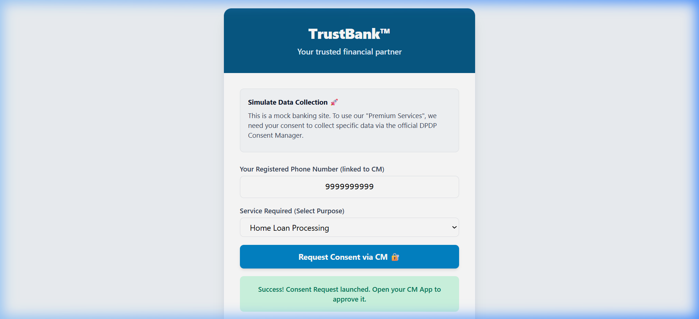
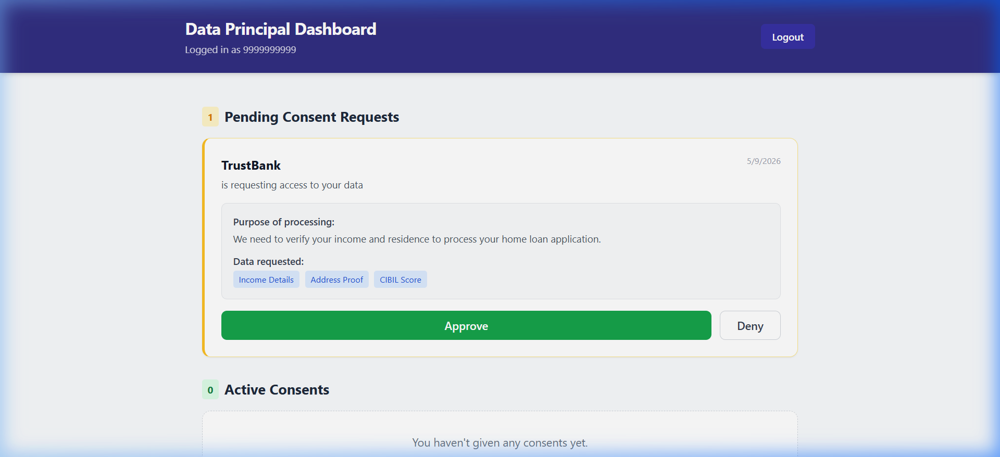
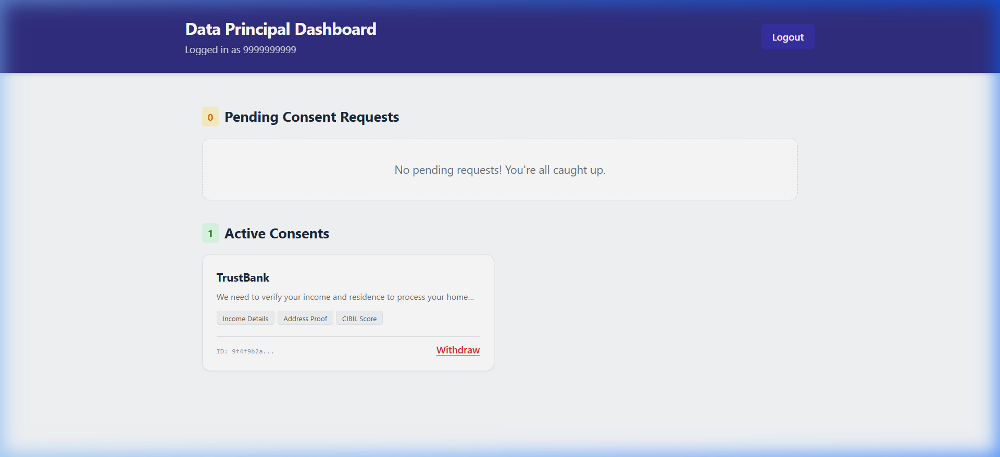
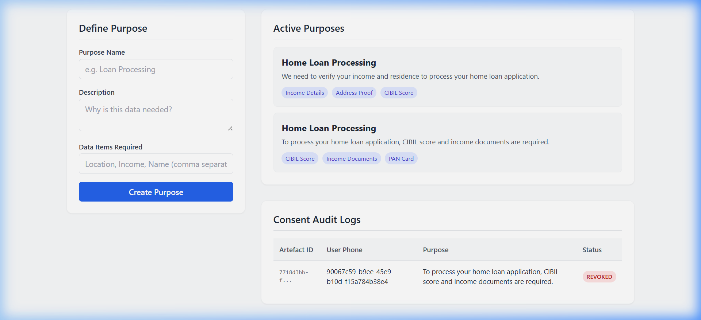

# 🇮🇳 DPDP Consent Management Platform

> A full end-to-end demonstration of the **India Digital Personal Data Protection (DPDP) Act, 2023** consent ecosystem — built with React, TypeScript, Node.js, Express, Prisma and SQLite.

[](LICENSE)
[](https://www.meity.gov.in/data-protection-framework)
[](https://nodejs.org)
[](https://reactjs.org)

---

## 📖 What is This?

The DPDP Act mandates that every Indian company (a **Data Fiduciary**) must:
1. Obtain **free, informed, specific, and unambiguous consent** before processing personal data.
2. Allow individuals (**Data Principals**) to **withdraw consent** at any time.
3. Maintain an **immutable audit trail** of all consent events.
4. Process Data Subject Requests (Erasure, Correction) within defined timelines.

This project simulates the **complete consent ecosystem** described by the Act — with three interconnected applications and two backends that talk to each other in real-time via **cryptographically signed Consent Artefacts** and **webhooks**.

---

## 🏗️ Architecture Overview

```
┌─────────────────────────────────────────────────────────────────┐
│                        DPDP Ecosystem                           │
│                                                                 │
│  ┌──────────────┐        Consent Request API     ┌───────────┐  │
│  │  TrustBank   │ ─────────────────────────────► │ CM Backend│  │
│  │ (Dummy Bank) │                                │  :4000    │  │
│  │   :3001      │ ◄──── Consent Artefact ───────  │           │  │
│  └──────────────┘       (via webhook)            └─────┬─────┘  │
│         │                                              │        │
│  ┌──────▼───────┐                              ┌───────▼──────┐  │
│  │CMP Dashboard │ ◄── Audit Logs (webhook) ─── │  CM User App │  │
│  │  (DPO Tool)  │                              │   :3003      │  │
│  │   :3002      │                              │  (User       │  │
│  │              │    Fiduciary Backend :4001   │   Remote     │  │
│  └──────────────┘                              │   Control)   │  │
│                                                └──────────────┘  │
└─────────────────────────────────────────────────────────────────┘
```

### The 5 Services

| Service | Port | Role |
|---------|------|------|
| **CM Backend** | 4000 | Central Consent Manager API — issues and revokes artefacts |
| **Fiduciary Backend** | 4001 | Data Fiduciary API — purposes, webhook receiver, audit logs |
| **Dummy Bank** (TrustBank) | 3001 | Simulated Data Fiduciary website |
| **CMP Dashboard** | 3002 | DPO Tool — define purposes, view audit logs |
| **CM User App** | 3003 | Data Principal's "remote control" to manage consents |

---

## 🔄 Consent Workflows

### A. Consent Grant Flow

```
User visits TrustBank     →   Bank selects a Purpose
        │                            │
        └──── POST /api/consent/initiate ──►  Fiduciary Backend
                                                     │
                                      POST /api/requests  ►  CM Backend
                                                                │
                                              ◄── Consent Request received ──
                                                                │
                                              User opens CM App (port 3003)
                                                                │
                                              Sees itemized notice (Purpose + Data Items)
                                                                │
                                              Clicks ✅ APPROVE
                                                                │
                                              CM Backend generates Consent Artefact
                                              (Cryptographically signed JSON)
                                                                │
                                              POST callbackUrl ──►  Fiduciary Backend /api/webhook
                                                                              │
                                                                   ConsentLog stored in SQLite DB
                                                                   (Status: ACTIVE)
                                                                              │
                                                                   DPO can see it in CMP Dashboard
```

### B. Consent Withdrawal (Revocation) Flow

```
User opens CM App  →  Views Active Consents  →  Clicks 🔴 WITHDRAW
                                                          │
                                         CM Backend updates Artefact to REVOKED
                                                          │
                                         POST callbackUrl ──►  Fiduciary Backend /api/webhook
                                                                       │
                                                          ConsentLog.status = 'REVOKED'
                                                                       │
                                                          DPO sees REVOKED status in audit log
```

---

## 🔐 The Consent Artefact

When a user approves a consent request, the system generates a **Consent Artefact** — a digitally signed proof object. This is the legal heart of the DPDP compliance mechanism.

```json
{
  "id": "9ec22abc-...",
  "userId": "90067c59-...",
  "fiduciaryId": "4f9b2ea1-...",
  "purposeText": "To process your home loan application...",
  "dataItems": "[\"CIBIL Score\",\"Income Documents\",\"PAN Card\"]",
  "signature": "SIGNED_OWVjMjJhYmMt...",
  "status": "ACTIVE",
  "createdAt": "2026-05-09T08:55:00.000Z",
  "revokedAt": null
}
```

| Field | Description |
|-------|-------------|
| `id` | Globally unique identifier — links CM and Fiduciary DB records |
| `signature` | Base64-encoded cryptographic proof (production: RS256/ECDSA) |
| `purposeText` | Exact text shown to the user — locked at time of consent |
| `dataItems` | Itemized list of data categories the user approved |
| `status` | `ACTIVE` or `REVOKED` |
| `revokedAt` | Timestamp of withdrawal (for SLA enforcement) |

> **Production security note**: The `signature` field in this demo is a simulated Base64 encoding. In a production system, this would be an **RS256 or ECDSA JWT** signed with the CM's private key, verifiable by any Fiduciary using the CM's public key endpoint.

---

## 🖥️ Demonstration Screenshots

### 1. Dummy Bank — Triggering a Consent Request
The simulated TrustBank website. The user selects the service they need and their phone number (linked to their CM account). Clicking the button dispatches a consent request to the Central CM.



---

### 2. CM User App — Pending Consent Request
The user logs into their Personal Consent Manager app using their phone number (OTP-simulated). The app shows an itemized, human-readable notice from TrustBank listing exactly what data they want and why.



---

### 3. CM User App — Active Consents After Approval
After clicking Approve, a cryptographic Consent Artefact is generated and delivered to TrustBank's webhook. The consent now appears in the user's Active Consents list with a Withdraw button.



---

### 4. CMP Dashboard — Audit Log (ACTIVE)
The DPO's internal dashboard receives the Artefact via webhook and logs the consent. This immutable record serves as proof of compliance during audits.


---

### 5. CMP Dashboard — Audit Log (REVOKED after Withdrawal)
When the user withdraws consent from their CM App, the Fiduciary Backend receives a revocation webhook and immediately updates the audit log. The DPO can see the status change to REVOKED in real-time.



---

## 🔒 Security Architecture

### Current Implementation
| Feature | Status | Notes |
|---------|--------|-------|
| CORS protection | ✅ | All backends restrict cross-origin access |
| API Key authentication | ✅ | Fiduciaries authenticate via `apiKey` on every request |
| Consent Artefact signing | ✅ (simulated) | Base64 demo; production uses RS256/ECDSA JWT |
| Webhook validation | ⚙️ Partial | Production needs HMAC-SHA256 signed payloads |
| Immutable audit logging | ✅ | `ConsentLog` records are append-only, `revokedAt` timestamped |

### Production Security Roadmap

#### 🔑 Identity & Access Management (IAM)
- Replace phone-OTP login with **Aadhaar-linked eKYC** or **DigiLocker** for Data Principal identity
- Fiduciaries should use **OAuth 2.0 Client Credentials** instead of static API keys
- Role-based access for DPOs: read-only auditor vs. write-access DPO vs. admin

#### 🪪 MFA (Multi-Factor Authentication)
- Enforce MFA for DPO Dashboard login (TOTP or hardware key)
- Consent approval should require biometric or OTP confirmation — critical DPDP requirement
- Step-up authentication for high-sensitivity purposes (healthcare, financial history)

#### 🔐 Cryptographic Hardening
- Sign Consent Artefacts with **RS256 JWT** using the CM's private key
- Publish CM public key at a `.well-known/jwks.json` endpoint
- Any Fiduciary can independently verify artefact authenticity without calling the CM

#### 🔍 Vulnerability Scanning
- Integrate **OWASP ZAP** or **Snyk** into CI/CD pipeline for SAST/DAST
- Scan for IDOR (Insecure Direct Object Reference) risks in the consent API (e.g., can User A revoke User B's consent?)
- Rate limiting and brute-force protection on the CM login endpoint

#### 📋 Audit & Compliance Logging
- Emit structured audit events to a **SIEM** (e.g., Azure Sentinel, Splunk) for real-time alerting
- Immutable log storage using **write-once S3 buckets** or **blockchain anchoring**
- Automated alerts for: consent requests with abnormally high data item counts, bulk revocations, or abnormal geographic patterns

---

## 🏢 Where Does OneTrust Fit?

**OneTrust** is a commercial **Fiduciary-side** Consent Management Platform — identical in role to the **CMP Dashboard + Fiduciary Backend** in this project. Here's a direct mapping:

| This Project | OneTrust Equivalent | Role |
|---|---|---|
| CMP Dashboard (`:3002`) | OneTrust Privacy Portal | DPO interface to define purposes |
| Fiduciary Backend (`:4001`) | OneTrust Backend SDK | Webhook receiver, Artefact storage, DSR handling |
| Dummy Bank Consent Widget | OneTrust Cookie Banner | Embedded snippet on business websites |
| CM User App (`:3003`) | ❌ No equivalent | OneTrust does NOT have a centralized CM; this is unique to DPDP |
| CM Backend (`:4000`) | ❌ No equivalent | DPDP-specific centralized registry |

> **Key insight**: OneTrust works within a single fiduciary's ecosystem. The **Centralized Consent Manager** (DPDP's novel contribution) is an interoperable, government-registered entity that works across ALL fiduciaries — something OneTrust does not implement.

---

## 🚀 Future Prospects

### Phase 2 — Production Hardening
- [ ] Replace SQLite with **PostgreSQL** (multi-tenant, HA-ready)
- [ ] Implement **RS256 Consent Artefact signing** using a HSM or AWS KMS
- [ ] Add Aadhaar/DigiLocker eKYC for Data Principal identity verification
- [ ] Implement the full **Data Subject Rights** portal (Erasure, Correction, Nomination)
- [ ] Define SLA timers per `RightsRequest` with automated escalation alerts

### Phase 3 — Ecosystem Integration
- [ ] Build a **public SDK/npm package** (`@dpdp/consent-widget`) for easy fiduciary integration
- [ ] Interoperability layer with **Account Aggregator (AA) framework** (RBI-regulated)
- [ ] Multi-language Consent Notices: support all **8th Schedule languages** (Hindi, Tamil, Bengali, etc.)
- [ ] Webhook retry queues using **Redis + BullMQ** to prevent data loss on fiduciary downtime

### Phase 4 — AI & Analytics
- [ ] **Anomaly detection on consent patterns** (ML model to flag unusual bulk consent requests)
- [ ] **NLP-powered purpose simplifier**: auto-translate legalese purpose text to plain language for users
- [ ] Compliance risk scoring for the DPO dashboard

---

## 🛠️ Local Setup

### Prerequisites
- Node.js 20+
- npm 9+

### Installation & Run

```bash
# Clone the repository
git clone https://github.com/OmHandeisCoding/dpdp-consent-platform.git
cd dpdp-consent-platform/dpdp-platform

# Push DB schemas
cd backend/cm-backend && npx prisma db push && cd ../..
cd backend/fiduciary-backend && npx prisma db push && cd ../..

# Install all frontend dependencies
cd frontend/dummy-bank && npm install && cd ../..
cd frontend/cmp-dashboard && npm install && cd ../..
cd frontend/cm-user-app && npm install && cd ../..

# Install root concurrently
npm install

# 🚀 Start all 5 services
npm run dev
```

### One-time Fiduciary Setup (after first `npm run dev`)
Open browser console on `http://localhost:3001` and run:
```js
// 1. Register TrustBank as a fiduciary
fetch('http://localhost:4000/api/fiduciary/register', {
  method: 'POST', headers: {'Content-Type':'application/json'},
  body: JSON.stringify({name:'TrustBank', callbackUrl:'http://localhost:4001/api/webhook'})
}).then(r=>r.json()).then(d=>{window._key=d.apiKey; console.log('API KEY:', d.apiKey);});

// 2. Configure the fiduciary backend (paste your API key)
fetch('http://localhost:4001/api/config', {
  method: 'POST', headers: {'Content-Type':'application/json'},
  body: JSON.stringify({companyName:'TrustBank', cmApiKey: window._key})
}).then(r=>r.json()).then(console.log);
```
Then go to `http://localhost:3002` to create Purposes, and the flow is ready!

---

## 📂 Project Structure

```
dpdp-platform/
├── backend/
│   ├── cm-backend/          # Central Consent Manager API (port 4000)
│   │   ├── src/index.ts     # Express routes: /api/requests, /api/consents
│   │   └── prisma/          # User, Fiduciary, ConsentRequest, ConsentArtefact
│   └── fiduciary-backend/   # Data Fiduciary API (port 4001)
│       ├── src/index.ts     # Express routes: /api/purposes, /api/webhook, /api/audit
│       └── prisma/          # Purpose, Customer, ConsentLog
├── frontend/
│   ├── dummy-bank/          # TrustBank demo site (port 3001)
│   ├── cmp-dashboard/       # DPO Tool (port 3002)
│   └── cm-user-app/         # User Consent Manager (port 3003)
└── docs/
    └── screenshots/         # Demo screenshots embedded in README
```

---

## 📜 License
MIT © 2026 — Built to demonstrate DPDP Act compliance architecture.

---

*Built with ❤️ for the Indian Data Privacy ecosystem.*
